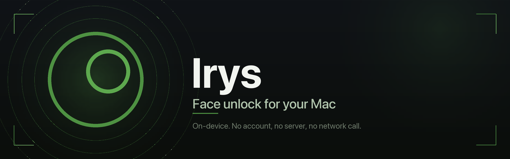
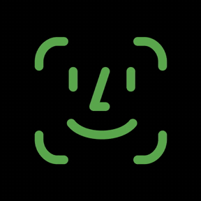
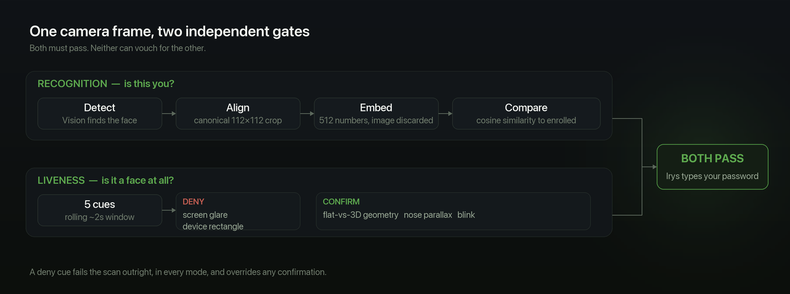
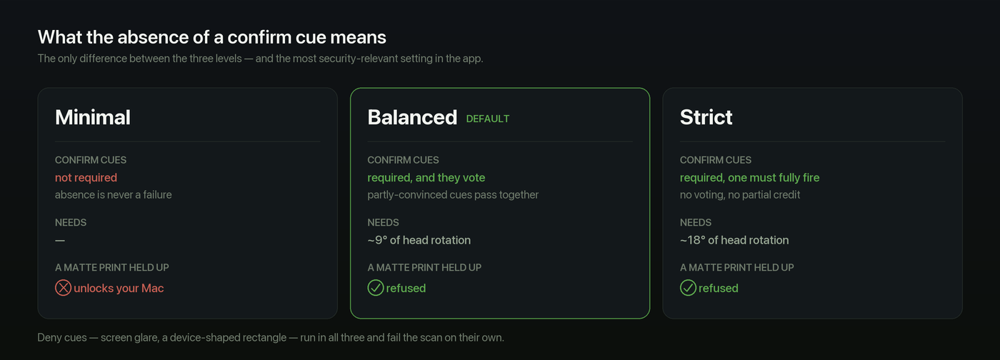

<p align="center">
  
</p>

<p align="center">
  <a href="LICENSE"></a>
  
  
  
  
</p>

Sit down at your locked Mac and it unlocks. No typing, no reaching for the Touch ID key.
Recognition, liveness and storage all happen on this machine — no account, no server, no
network call, ever.

Irys lives in the notch. A pill expands while it looks for you, and collapses when it's done.

<p align="center">
  
</p>
<p align="center">
  <sub><i>Looking for you → recognised → unlocked. Irys' own notch animations.</i></sub>
</p>

---

## Read this before you install

**Irys is a convenience feature, not a security upgrade.** It is not as strong as Touch ID or
iPhone Face ID, and the reasons are worth understanding rather than skimming.

> ### It types your password
>
> macOS provides no way for a third-party app to authorize a login. That is not a gap we failed
> to look for — it was checked properly: the smartcard route (`CryptoTokenKit`) requires real
> hardware, and the screensaver authorization right delegates to loginwindow instead of running
> a mechanism chain a plugin could join. So Irys recognises your face and then **enters your
> password for you**.
>
> Your password therefore lives on this Mac in a form that can be replayed. It is encrypted,
> gated behind Touch ID, and never leaves the device — but it exists. Every product in this
> category works this way, including the hardware ones; most of them don't say so.

**A MacBook webcam sees a flat image.** An iPhone projects 30,000 infrared dots and builds a
depth map. Irys has one 2D camera and infers depth from parallax as you move. So:

- On **Balanced** (the default) and **Strict**, a printed photo and a photo on a phone screen
  are refused.
- On **Minimal**, they are not. A matte print held so its edges leave frame will unlock your
  Mac in a few seconds. This was reproduced on real hardware. It is why Minimal is not the
  default, and why choosing it asks you to confirm.
- A **video of you** is not reliably defeated by anything here.
- Holding **perfectly still** can stall a scan, because every liveness cue measures motion you
  have to supply. Balanced needs roughly 9° of head movement; Strict roughly 18°.

If someone with physical access to your Mac and a photo of you is in your threat model, use
Touch ID.

## Install

Requires macOS 15 or later.

**[Download the latest release](../../releases/latest)**, open the `.dmg`, drag Irys to
Applications.

Signed with a Developer ID certificate, notarized by Apple and stapled, so it opens without a
Gatekeeper warning.

### Permissions

| Permission | Why |
|---|---|
| **Camera** | To see your face. Frames are processed in memory and never written to disk. |
| **Accessibility** | To type your password at the lock screen. |
| **Touch ID** | Gates the key that encrypts your face data and your password. |

## How it works

1. **Enroll.** Turn your head in a slow circle. Coverage fills in wherever you happen to look —
   there is no queue of poses to hit in a fixed order. Each accepted frame becomes a 512-number
   *embedding*, a mathematical fingerprint, and the image itself is discarded.
2. **Store your password once**, encrypted behind Touch ID.
3. **Lock or wake your Mac.** The notch expands and starts looking.
4. **Recognition and liveness run as two independent gates.** Both must pass. Then Irys types
   the password.

<p align="center">
  
</p>

### How it tells a face from a photograph

Five cues over a rolling ~2s window, in two roles:

- **Deny cues** are evidence of a spoof — screen glare, or a device-shaped rectangle around the
  face. Either one fails the scan outright, in every mode, and overrides any confirmation.
- **Confirm cues** are evidence of a real face — flat-vs-3D landmark geometry, nose parallax
  across head turns, blinks.

What a confirm cue's *absence* means is the entire difference between the three levels, and it
is the most security-relevant thing in this app.

<p align="center">
  
</p>

| Level | Confirm cues | A matte print |
|---|---|---|
| **Minimal** | not required — absence is never a failure | **unlocks your Mac** |
| **Balanced** *(default)* | required, and they vote: each cue is normalised against its own firing threshold and summed, so several partly-convinced cues pass together. Because no single cue decides alone, Balanced also reads at half the head rotation the others need | refused |
| **Strict** | required, and one cue must fully fire on its own | refused |

<sub>The two rings in the Irys mark are not concentric, and the offset is the point: depth pushes
a real face's features off-axis when you turn your head, and a flat photograph's stay put. That
difference is the cue the whole liveness check is built on.</sub>

## Features

| | |
|---|---|
| **Triggers** | On wake, on lock, or on pressing space at the lock screen. Any combination. |
| **Multiple identities** | Several people, or several versions of you — with glasses, a beard, different lighting. This is the fix when recognition gets unreliable; it is the equivalent of Face ID's Alternate Appearance. |
| **Liveness strength** | Minimal / Balanced / Strict, or off. Weakening it asks first, and says exactly what you give up. |
| **Camera & display** | Pick which camera, including a different one for an external monitor. |
| **Auto-locking sessions** | The Touch ID session re-locks after an idle period you choose, so an unattended Mac doesn't stay authorized forever. |
| **Face Lab** | A hidden console showing every cue's live reading. Settings → About → click the icon five times. |

## Privacy

- **No network.** Recognition, enrollment and liveness run entirely on-device via Vision and
  Core ML. Nothing is uploaded; there is no account and no telemetry.
- **No images stored.** Enrollment keeps embeddings, not photographs. Frames are discarded.
- **Two-tier encryption.** A session key sits in the Keychain behind Touch ID
  (`.userPresence`) and unwraps your password and face embeddings with AES-GCM. The encrypted
  blobs themselves are ungated — useless without the key — because macOS cannot show a Touch ID
  prompt at the lock screen, which is precisely where the app needs to read them.

## Building

The ArcFace weights are **not** in the repository — at 166MB they exceed GitHub's per-file
limit. Generate them before the first build:

```bash
python3 -m venv .venv && source .venv/bin/activate
pip install -r tools/requirements.txt
python tools/convert_arcface.py --variant w600k_r50 --precision float32
```

`--precision float32` is required for this backbone. At float16 the converted model agrees with
the original to only 0.9977 — measured on both random and realistic input, so it is genuine
precision loss rather than an artefact of the test — while float32 agrees to 1.000000.

Then open `glance.xcodeproj` and build, or:

```bash
tools/release.sh ~/Desktop             # build, sign, notarize, staple
tools/make_dmg.sh ~/Desktop/Irys.app   # styled, signed, notarized disk image
```

Both need a Developer ID certificate and a `notarytool` keychain profile; see the comments at
the top of each script.

### Tests

There is no Xcode test target. The liveness cues and the whole fire/latch decision model are
covered by a standalone, camera-free harness:

```bash
swiftc -O -o /tmp/liveness_selftest \
  glance/Liveness/LandmarkGeometry.swift glance/Liveness/GeometryLiveness.swift \
  glance/Liveness/GlareCue.swift glance/Liveness/LivenessCues.swift \
  glance/Liveness/LivenessScoring.swift glance/Liveness/LivenessAnalyzer.swift \
  tools/liveness_selftest.swift && /tmp/liveness_selftest
```

It drives the real decision code frame by frame with synthetic live faces and synthetic attacks
— still photos, a tilted photo, and a flat photo moved in a pure homography — and asserts which
get in. Every liveness change should be proven here before it lands.

## Design notes

Longer write-ups of the things that were investigated rather than guessed at live in
[`docs/proposals/`](docs/proposals):

| | |
|---|---|
| **[001](docs/proposals/001-ring-light-feasibility.md)** | A screen-edge ring light for dark rooms. An EDR Metal layer measurably doubles available white with no private API; the Mac camera exposes no exposure controls at all, which reshapes the whole design. |
| **[002](docs/proposals/002-macos-auth-integration.md)** | Whether the stored password can be eliminated. For screen unlock: no. `sudo` is a different story. |
| **[003](docs/proposals/003-external-biometric-devices.md)** | What external fingerprint keys for Mac actually do. They store your password and type it, same as this. |
| **[004](docs/proposals/004-single-frame-antispoofing.md)** | Single-frame anti-spoofing models, and why one would have to be a deny cue. |

## Credits

Irys is a fork of **[Glance](https://github.com/jonnyoo/glance)** by Jonathan Zhou, which is the
origin of essentially all of the architecture here — the notch overlay, the recognition
pipeline, the liveness cue model and the Face Lab console. This fork changes the liveness
defaults and scoring, the recognition model, enrollment, the signing and release pipeline, and
the branding. The foundation is his.

- **[The Boring Notch](https://github.com/TheBoredTeam/boring.notch)** — notch window physics.
- **[InsightFace](https://github.com/deepinsight/insightface)** — the ArcFace recognition model.
- **[SkyLightWindow](https://github.com/Lakr233/SkyLightWindow)** — the lock-screen window
  technique.
- **[Alcove](https://tryalcove.com)** — design inspiration.

## License

[MIT](LICENSE) © Jonathan Zhou. Fork modifications © Jayden Ghiyam.

Irys remains under the same MIT licence, which requires the original copyright notice be kept.

**The bundled face-recognition weights are not covered by it.** They come from
[InsightFace](https://github.com/deepinsight/insightface), whose pretrained models are released
for non-commercial research use. Irys is free and is not sold; anyone intending to sell a
derivative needs to resolve that separately.
